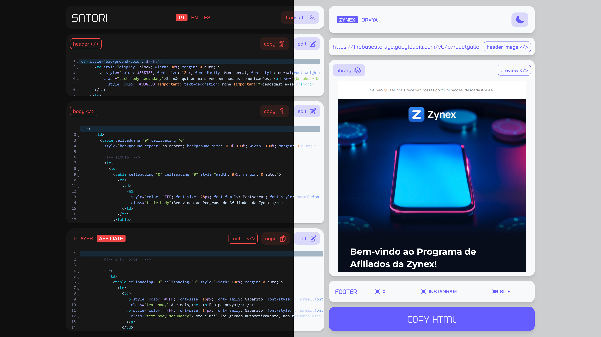

# Satori

## About

Satori is an HTML translation tool that preserves tag structure and translates only the text content.
Includes a live editor, multi-language support, real-time visual preview.

Site: https://satori.empthy.dev/
 
 

## Features

- Translates HTML content without modifying tag structure.
- Built-in HTML editor with syntax highlighting (CodeMirror).
- Manual editing of the translated content.
- Real-time visual preview.

 

 
 

# Tech Stack

- Typescript
- NextJs
- Tailwind
- Deepl API
- Next Themes
- Axios
- CodeMirror
- Hero Icons
- Framer Motion

 

### Author

Nathan Stabille

https://www.linkedin.com/in/nathan-stabille

https://empthy.dev
