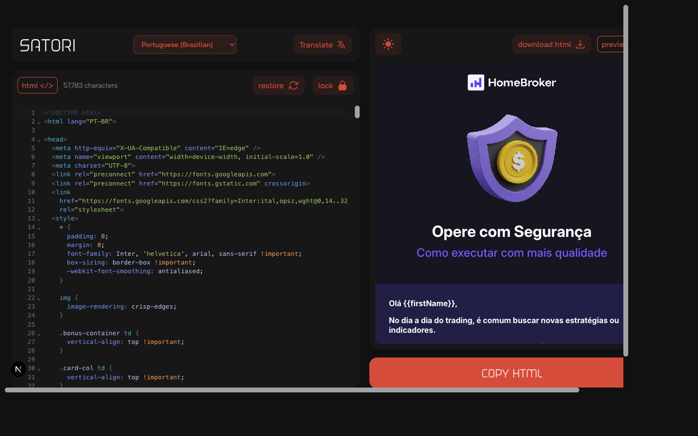

# Satori

Satori is a browser-based HTML translation tool that translates visible text while preserving the original document structure. It combines a syntax-highlighted editor, live preview and DeepL integration in a focused workflow.

## Demo

Live application: [satori.empthy.dev](https://satori.empthy.dev/)



## Features

- Translate HTML without sending the API key to the browser.
- Preserve HTML tags, attributes and document structure with DeepL HTML handling.
- Load target languages dynamically from DeepL, including regional variants.
- Edit HTML with CodeMirror syntax highlighting.
- Preview the current document in an isolated sandboxed iframe.
- Restore the default example and persist work locally between sessions.
- Copy or download the current HTML document.
- Support light and dark themes.
- Validate request payloads and reject invalid or oversized HTML on the server.

## Architecture

The browser owns the editing experience and sends translation requests to the Next.js server. The server reads the DeepL credential from the environment, infers the source language from the HTML `lang` attribute when available, and forwards only the required request to DeepL.

```text
CodeMirror editor -> Next.js API route -> DeepL API
	  |                  |
	  v                  v
  Local storage       Validated HTML
	  |
	  v
  Sandboxed preview
```

## Tech stack

- Next.js App Router
- React and TypeScript
- Tailwind CSS
- CodeMirror
- DeepL API
- Axios
- next-themes
- Framer Motion
- Heroicons

## Getting started

### Requirements

- Node.js 20 or newer
- A DeepL API key

### Installation

```bash
npm install
cp .env.example .env
```

Add your key to `.env`:

```env
DEEPL_API_KEY=your_deepl_api_key
```

Start the development server:

```bash
npm run dev
```

Open [http://localhost:3000](http://localhost:3000).

## Commands

```bash
npm run dev      # Start development server
npm run lint     # Run ESLint
npm run build    # Create production build
npm run start    # Start production server
```

## API routes

| Method | Route            | Purpose                           |
| ------ | ---------------- | --------------------------------- |
| `GET`  | `/api/languages` | Returns DeepL target languages    |
| `POST` | `/api/translate` | Translates validated HTML content |

The translation route accepts `htmlContent` and `target_lang`. It limits documents to 100,000 characters and returns meaningful HTTP statuses for invalid input, oversized content and upstream service failures.

## Future improvements

- Import HTML files with drag and drop.
- Add translation history and side-by-side comparison.
- Add automated unit and end-to-end tests.
- Add CI checks for lint, build and API behavior.

## Author

Nathan Stabille

- [LinkedIn](https://www.linkedin.com/in/nathanstabille)
- [Website](https://empthy.dev)
